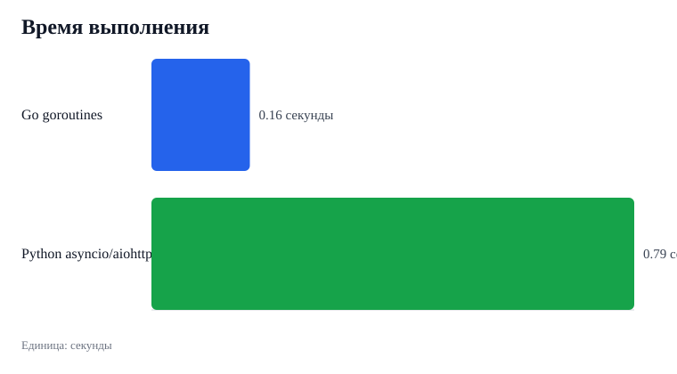
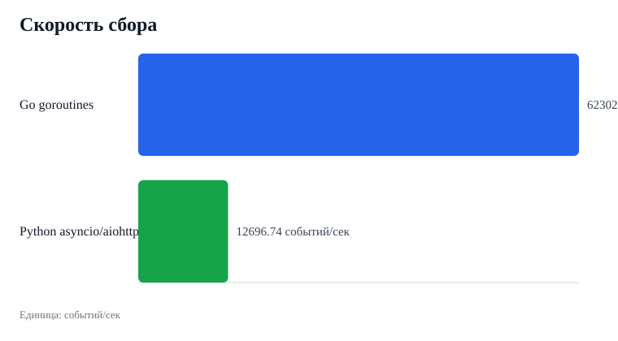
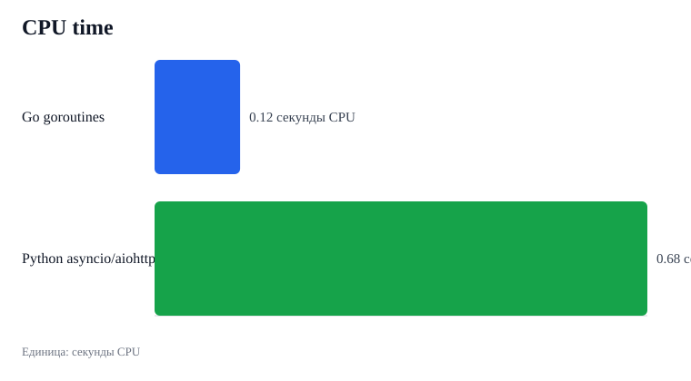
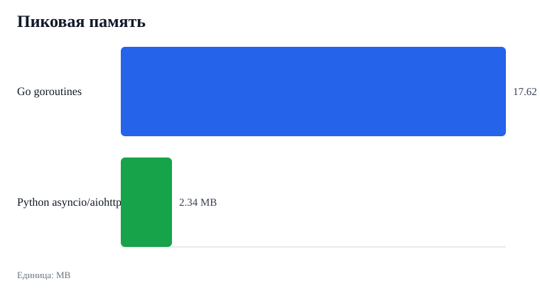

# Benchmark Go vs Python для задания 6

Дата генерации: 2026-05-28T19:50:06Z

## Нагрузка

- Источник данных: локальный mock NASA EONET API с endpoint `/events`.
- Категории: wildfires, severeStorms, drought, seaLakeIce, dustHaze.
- Итерации: 8.
- Событий на категорию: 250.
- HTTP-запросов на каждый коллектор: 40.
- Задержка ответа mock API: 0.010 секунды.
- Общие параметры: `days=365`, `status=all`.

## Результаты

| Tool | Requests | Events | Time | Events/s | CPU | MB |
| --- | ---: | ---: | ---: | ---: | ---: | ---: |
| Go goroutines | 40 | 10000 | 0.1605 | 62302.63 | 0.1188 | 17.62 |
| Python asyncio/aiohttp | 40 | 10000 | 0.7876 | 12696.74 | 0.6843 | 2.34 |

Самый быстрый запуск по wall-clock времени: **Go goroutines**.

## Графики









## Как воспроизвести

```bash
make benchmark
```

Скрипт поднимает mock API и прогоняет оба коллектора.
Затем он обновляет отчёт, JSON-результаты и SVG-графики.
